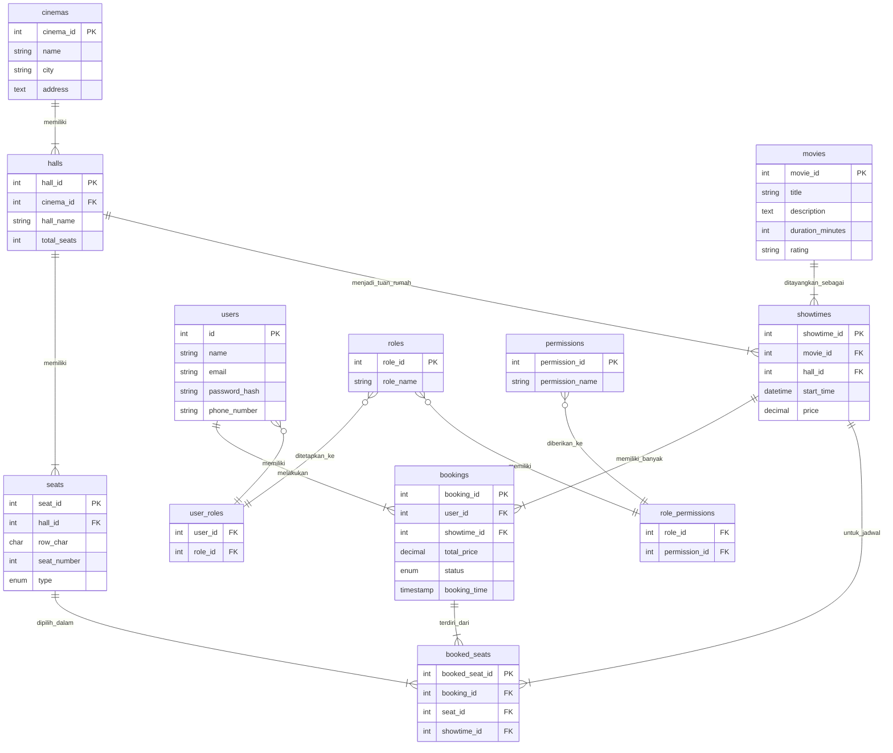
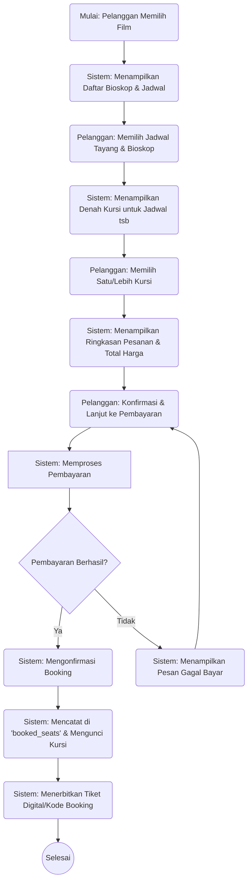

```mermaid
erDiagram
    cinemas {
        int cinema_id PK
        string name
        string city
        text address
    }
    halls {
        int hall_id PK
        int cinema_id FK
        string hall_name
        int total_seats
    }
    seats {
        int seat_id PK
        int hall_id FK
        char row_char
        int seat_number
        enum type
    }
    movies {
        int movie_id PK
        string title
        text description
        int duration_minutes
        string rating
    }
    showtimes {
        int showtime_id PK
        int movie_id FK
        int hall_id FK
        datetime start_time
        decimal price
    }
    users {
        int id PK
        string name
        string email
        string password_hash
        string phone_number
    }
    bookings {
        int booking_id PK
        int user_id FK
        int showtime_id FK
        decimal total_price
        enum status
        timestamp booking_time
    }
    booked_seats {
        int booked_seat_id PK
        int booking_id FK
        int seat_id FK
        int showtime_id FK
    }

    roles {
        int role_id PK
        string role_name
    }
    user_roles {
        int user_id FK
        int role_id FK
    }
    permissions {
        int permission_id PK
        string permission_name
    }
    role_permissions {
        int role_id FK
        int permission_id FK
    }

    %% --- Definisi Relasi ---

    %% Relasi Inti
    cinemas         ||--|{  halls           : "memiliki"
    halls           ||--|{  seats           : "memiliki"
    halls           ||--|{  showtimes       : "menjadi_tuan_rumah"
    movies          ||--|{  showtimes       : "ditayangkan_sebagai"
    users           ||--|{  bookings        : "melakukan"
    showtimes       ||--|{  bookings        : "memiliki_banyak"

    %% Relasi Pemesanan Kursi (Pusat)
    bookings        ||--|{  booked_seats    : "terdiri_dari"
    seats           ||--|{  booked_seats    : "dipilih_dalam"
    showtimes       ||--|{  booked_seats    : "untuk_jadwal"

    %% Relasi RBAC (Many-to-Many)
    users           }o--||  user_roles      : "memiliki"
    roles           }o--||  user_roles      : "ditetapkan_ke"

    roles           }o--||  role_permissions : "memiliki"
    permissions     }o--||  role_permissions : "diberikan_ke"
```

```mermaid
graph TD;
    %% Definisikan Node (Langkah)
    A(Mulai: Pelanggan Memilih Film) --> B(Sistem: Menampilkan Daftar Bioskop & Jadwal);
    B --> C(Pelanggan: Memilih Jadwal Tayang & Bioskop);
    C --> D(Sistem: Menampilkan Denah Kursi untuk Jadwal tsb);
    D --> E(Pelanggan: Memilih Satu/Lebih Kursi);
    E --> F(Sistem: Menampilkan Ringkasan Pesanan & Total Harga);
    F --> G(Pelanggan: Konfirmasi & Lanjut ke Pembayaran);
    G --> H[Sistem: Memproses Pembayaran];

    %% Definisikan Keputusan (Decision)
    H --> I{Pembayaran Berhasil?};

    %% Alur Sukses
    I -- Ya --> J(Sistem: Mengonfirmasi Booking);
    J --> K(Sistem: Mencatat di 'booked_seats' & Mengunci Kursi);
    K --> L(Sistem: Menerbitkan Tiket Digital/Kode Booking);
    L --> M((Selesai));

    %% Alur Gagal
    I -- Tidak --> N(Sistem: Menampilkan Pesan Gagal Bayar);
    N --> G;
```
